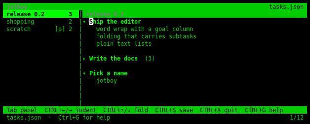
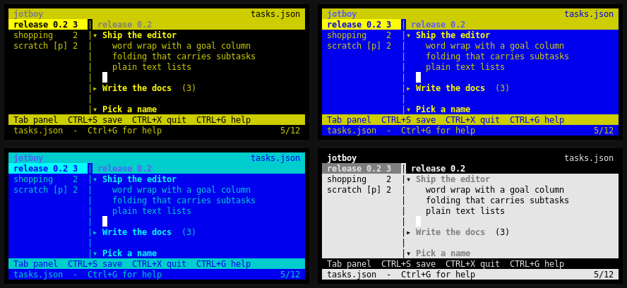

# jotboy

A two-panel ncurses task outliner. The left panel holds top-level task lists;
the right panel is a word-wrapping text editor whose lines form a task tree,
with nesting expressed as a two-space indent.

New here? Read **[QUICKSTART.md](QUICKSTART.md)** — this file is the full
reference. Licence: GPL-3.0-or-later, see **[COPYRIGHT.md](COPYRIGHT.md)** and
`COPYING`.



<details>
<summary>the same screen as text</summary>

```
 jotboy                                                                      tasks.json
 release 0.2       3  | release 0.2
 shopping          2  |▾ Ship the editor
 scratch       [p] 2  |    word wrap with a goal column
                      |    folding that carries subtasks
                      |    plain text lists
                      |
                      |▸ Write the docs  (3)
                      |
                      |▾ Pick a name
                      |    jotboy
 Tab panel  CTRL+←/→ indent  CTRL+↑/↓ fold  CTRL+S save  CTRL+X quit  CTRL+G help
 tasks.json  -  Ctrl+G for help                                                    1/12
```

</details>

## Running

Only the standard library is needed:

```sh
python3 jotboy.py                 # empty unnamed buffer; nothing is read
python3 jotboy.py mytasks.json    # open that file, or start one under that name
python3 jotboy.py --theme purple mytasks.json      # green (default), purple, blue
python3 jotboy.py mytasks.json --export   # print the tasks as indented text
```

With no filename jotboy reads nothing from disk and invents no sample content:
you get one empty `untitled` list, and the title bar says `(no file)`. The
first `Ctrl+S` asks for a name, exactly as `Ctrl+O` would. Quitting an
untouched buffer asks nothing.

Naming a file that does not exist works the same way, but the name is already
set — the file is not created until you save.

The venv here is for the test suite only:

```sh
.venv/bin/python -m pytest test_jotboy.py -q
```

## Keys

| Key | Action |
| --- | --- |
| `Tab` | move focus between the two panels |
| **left panel** | |
| `↑` / `↓` | select a task list |
| `Enter` | open it in the editor |
| `Ctrl+N` / `Ctrl+D` | new list (asks structured or plain text) / delete list |
| `Ctrl+R` (or `F2`) | rename list |
| `Alt+↑` / `Alt+↓` | move the list up / down |
| **right panel** | |
| `↑` `↓` `←` `→` | move the caret; vertical motion steps by *wrapped* row |
| `Home` `End` `PgUp` `PgDn` | row ends, page up / down |
| typing, `Backspace`, `Del` | edit text |
| `Ctrl+→` / `Ctrl+←` | indent / outdent the task — subtasks come along |
| **two spaces** at column 0 | indent: make the line a subtask |
| `Backspace` at column 0 | outdent, then merge into the line above |
| `Enter` | split the line, or add a sibling / first subtask |
| `Ctrl+↑` | collapse the task (on a leaf: jump to the parent and collapse it) |
| `Ctrl+↓` | expand the task |
| `Alt+↑` / `Alt+↓` | move the task up / down among its siblings |
| `Ctrl+K` | cut the task and all its subtasks |
| `Ctrl+U` | paste it after the caret's task, at the indent it was cut at |
| **global** | `Ctrl+Y` copy list out, `Ctrl+H` hide/show the list panel, `Ctrl+F` find, `Ctrl+S` save, `Ctrl+O` save as, `Ctrl+T` theme, `Ctrl+X` quit, `Ctrl+G` help |

`Ctrl+Y` puts the whole open list on the **system** clipboard as UTF-8, in
the same indented plain text the panel shows — folded-away subtasks included,
since it copies the list rather than what happens to be visible. It pipes to
the first of `wl-copy`, `xclip`, `xsel`, `pbcopy` or `clip.exe` that exists
and succeeds; with none of them installed it asks the terminal itself via an
OSC 52 escape, which is what works over ssh (though many terminals disable it
for security). The status line names which route it took, and how many bytes
went out.

This is separate from `Ctrl+K`/`Ctrl+U`, which move tasks *within* jotboy and
are untouched by it.

`Ctrl+H` hides the list panel outright and gives its columns to the editor,
which is worth a fifth of the width on a narrow terminal. `Ctrl+H` again
brings it back, and so does `Tab` — with the panel hidden there is nowhere to
switch to, so `Tab` reveals it rather than doing nothing. While it is hidden
the hint bar swaps `Tab panel` for `CTRL+H lists`, and the editor's title bar
still names the open list.

A caveat: `Ctrl+H` *is* ASCII 8, which some terminals send for Backspace. If
yours does, jotboy treats it as Backspace — deleting text matters more than the
panel — and `Tab` remains the way to hide and show the panel.

`Ctrl+F` searches the open list. It prompts with the last term ready to go, so
pressing `Ctrl+F` then `Enter` walks to the next match; the search runs from
just after the caret and wraps round, says so when it does, and opens a fold
if the match is hidden inside one. It is case-insensitive, and works from
either panel — finding something in the list panel moves you into the editor
at the match.

Every function key is only ever an alias — terminals steal them (xfce4-terminal
takes `F1` for its own help and `F10` for the menu bar). `Ctrl+G` opens the
help, `Ctrl+R` renames a list, and `Ctrl+X` quits, so nothing is reachable
*only* through a function key.

**The left panel takes a dark background while it has focus** — the whole
panel, header and empty rows included, so which side is live is obvious
without hunting for a cursor. The selected list reverses out of that slab.
With the editor focused the panel goes back to normal and the open list is the
only highlighted row. The right panel is never shaded; its caret already says
where you are.

The slab is the theme's darkest tone, falling back to a solid block of the
theme hue on eight-colour terminals and to plain reverse video with no colour
at all — so the focused panel is always distinguishable.

## Themes

Eight schemes. Pick one with `--theme`, or cycle with `Ctrl+T` while running.

| `--theme` | | |
| --- | --- | --- |
| `green` | green on black | the default; P1 phosphor |
| `purple` | purple on black | |
| `blue` | blue on black | |
| `white` | white on black | plain monochrome VDU |
| `amber` | amber on black | VT220 / Hercules phosphor |
| `amstrad` | yellow on blue | Amstrad CPC 464 |
| `c64` | light blue on blue | Commodore 64 |
| `mac` | black on white | Macintosh, and a check that a light scheme really does override a dark terminal |



*Clockwise from top left: `amber`, `amstrad`, `c64`, `mac`.*

jotboy **enforces its palette instead of inheriting the terminal's.** Every pair
names a foreground *and* a background, and the screen gets a painted backdrop,
so a light-background or solarised terminal still renders jotboy identically —
nothing shows through from the terminal's own colours.

Each theme names six tones — page, text, bright, dim, panel slab, and the
band colour the title and key bars use — so a theme is not just a foreground
hue: `amstrad` paints the *page* blue, and `mac` paints it white.

The tones are 256-colour cube indices (16 and up). Terminal themes redefine
the 0–15 range but leave the cube alone, so the hues come out predictable
without `init_color()` rewriting the terminal's palette out from under other
programs. On an eight-colour terminal each theme collapses to its two base
colours — still enforced, just fewer shades, and yellow degrades to ANSI 3,
which is really brown.

**Both the hint bar and the help follow the focused panel**, so they only ever
advertise keys that do something where you are. Move to the list panel and the
bar swaps `CTRL+←/→ indent` for `CTRL+N new  CTRL+R rename  CTRL+D delete`;
`Ctrl+G` puts that panel's section first and titles itself `keys: task lists`.
The other panel's section is still in the overlay, below the shared keys.

When the terminal is too narrow for every hint, they drop by usefulness —
`Ctrl+S`, `Ctrl+X` and `Ctrl+G` are the last to go.

Quitting with unsaved changes asks `Save before quitting?` and takes a single
keystroke — `y` saves, `n` discards, `Esc` carries on editing. No Enter, and
anything else is ignored, so a stray key can neither quit nor throw work away.
The `(y/N)` questions that delete a list or overwrite a file still want Enter:
those are destructive and worth a deliberate second keystroke.

`Ctrl+O` is nano's "write out": it prompts with the current file name ready to
edit, asks before overwriting a *different* existing file, and then keeps
editing under the new name, so `Ctrl+S` afterwards saves there. In any prompt,
`Ctrl+U` clears the line, `Ctrl+K` cuts to the end, and `Esc` cancels.

`Esc` and `Ctrl+]` are bound to nothing; `Esc` only cancels a prompt.

## Structured lists and plain text lists

`Ctrl+N` asks which kind of list you are making — one keystroke, no Enter:

```
s = structured   p = plain text   Esc = cancel
```

A **structured** list is everything described above: two-space nesting,
folding, subtasks that travel with their parent, top-level tasks in bold.

A **plain text** list is just lines. No indenting, no folding, no bold, no
fold arrows, and no gutter — text starts at the left edge. Two spaces at the
start of a line stay two spaces, `Ctrl+←`/`Ctrl+→` and `Ctrl+↑`/`Ctrl+↓` say
so rather than doing something, and `Backspace` at column 0 merges straight
into the line above instead of outdenting first. Everything that still makes
sense keeps working: typing, word wrap, `Alt+↑`/`Alt+↓` to reorder lines,
`Ctrl+K`/`Ctrl+U`, `Ctrl+F`, `Ctrl+Y`.

Plain lists carry a **`[p]`** suffix in the left panel:

```
 shopping     2  | notes  [plain text]
 notes    [p] 3  |shopping list
 house        2  |milk
                 |  eggs
```

The editor's title bar says `[plain text]` too, so the mode is still visible
when `Ctrl+H` has hidden the panel, and the hint bar drops `indent` and `fold`
since neither applies. The kind is stored per list, so it survives saving; a
file written before this existed opens as a structured list, nesting intact.

The kind is fixed when the list is created — there is no convert-in-place.

### Blank lines are never indented

Two blank lines at different depths look identical on screen but belong to
different tasks, so the editor does not keep them: **a blank line is always at
the top level.** The one exception is the line you are currently typing into —
`Enter` at the end of `Buy food` opens an empty subtask and holds it at depth
while the caret is there, so you can just start typing.

Move away without typing anything and the line is tidied: it flattens to the
top level, becoming an ordinary separator. If flattening would adopt the tasks
below it — a blank line in the *middle* of a group — it is dropped instead,
which leaves the group intact rather than silently re-parenting its subtasks.

Loading a file applies the same repair, so a hand-edited file cannot smuggle
one in.

### Moving a task with cut and paste

`Ctrl+K` then `Ctrl+U` is how work moves around, so **the clipboard keeps the
indent it was cut at** and goes in after the caret's task and its subtasks.
A subtask therefore stays a subtask wherever it lands:

```
A                         cut f, put the caret on c, Ctrl+U
  b                       ->  f arrives at c's level, as its sibling
  c
                          A                 D
D                           b                 e
  e                         c
  f                         f
```

Dropped on a task one level *shallower*, that same clipboard becomes its
subtask — put the caret on `D` instead and `f` returns as a child of `D`.
Nothing is derived from the destination, so a cut never silently changes an
item's depth.

A cut subtree keeps its internal shape too: cutting `Buy food` brings its
subtasks along and puts them back one level under it. If the landing spot
happens to be inside a collapsed task, that task is expanded so
the paste is never dropped out of sight, and if the indent would skip a level
it is clamped to a legal one. Pasting onto a blank spacer line fills the line
in place instead of going after it.

To change depth afterwards, `Ctrl+←` / `Ctrl+→` right after the paste.

### Indenting

Three ways in, all doing the same thing to the task *and its subtasks*:

* `Ctrl+→` indents, `Ctrl+←` outdents.
* **Two spaces** typed at the start of a line indent it. The first space
  appears as an ordinary space, so `" x"` stays literal text; only a second
  space at column 1 converts the pair into an indent level. Four spaces indent
  two levels, and so on.
* `Backspace` at column 0 outdents, and merges into the line above only once
  the line is already at the top level.

Indenting is refused — with a note on the status line, and with the two spaces
left as literal text if that was how you asked — when it would skip a level,
i.e. put a line more than one level deeper than the task above it.

## Behaviour worth knowing

* **Moving carries subtasks.** Every move and indent change operates on the
  whole subtree, and a task can never jump out of its parent — moving the last
  subtask down just says so rather than promoting it.
* **Collapsing hides descendants only**; a collapsed parent shows `(n)`, the
  number of hidden lines.
* **Blank lines are spacers, not tasks**, so they render no fold arrow even
  when a deeper line follows them. The exception is a blank line that is
  *collapsed*: there the arrow and the `(n)` count are the only sign that
  anything is hidden underneath, so they stay.
* **A blank line is never indented** — see below.
* **`Ctrl+K` cuts the whole tree.** A task always travels with its subtasks,
  folded or not, exactly as moving and indenting carry them — a cut can never
  leave subtasks orphaned. On a leaf it takes the one line. Consecutive
  `Ctrl+K`s accumulate into one clipboard, as in Emacs.
  (To drop a parent but keep its children, outdent them with `Ctrl+←` first.)
* **`Enter`** at the end of a parent creates its first subtask; on a *collapsed*
  parent it creates a sibling after the hidden subtree, so nothing is buried.
* **Merging is refused** when the line has subtasks, rather than silently
  orphaning them.
* **Word wrap** breaks on spaces, hangs continuation rows under the text, and
  keeps a goal column across vertical motion.
* Blank lines are ordinary lines: in the sample data a blank separates the two
  groups, so moving `Buy food` down once swaps it with that blank line.

## Storage

JSON, written atomically (temp file + `os.replace`), so an interrupted save
cannot corrupt an existing file. Collapsed state, caret position and the kind
of each list all persist. `--export` prints the plain indented text shown in
the panel.

```json
{
  "version": 1,
  "lists": [
    {
      "title": "shopping",
      "cursor": 0,
      "col": 0,
      "plain": false,
      "lines": [
        {"t": "Buy food", "i": 0, "c": false},
        {"t": "eggs", "i": 1, "c": false}
      ]
    }
  ]
}
```

`cursor` is the caret's line and `col` its column within that line's text;
`plain` marks a plain text list. A line is `t`ext, `i`ndent and `c`ollapsed.
Note that `t` never contains the indent — that is added when drawing.

Every field has a default on load, so a file missing one still opens; that is
what keeps older files working when a new option appears. `load()` also
repairs anything that breaks the model's invariants rather than trusting the
file.

A buffer is only ever marked unsaved once you change something, so `Ctrl+X`
asks about your edits and never about a file you merely opened.

## Internals

Everything is in `jotboy.py`, standard library only, in this order. Line numbers
drift; the banner comments are the landmarks.

| Section | What lives there |
| --- | --- |
| key input | `KeyReader`, `_init_named`, `_with_mod` |
| word wrap | `wrap_segments` |
| model | `Line`, `TaskList`, and the free functions that read the tree |
| persistence | `blank_store`, `load`, `save`, `list_text`, `as_text` |
| the system clipboard | `CLIPBOARD_TOOLS`, `to_clipboard`, `osc52` |
| application | `Row`, the `HELP_*` tables, `App` |
| themes | `Theme`, `THEMES`, `theme_pairs` |
| bootstrap | `start`, `main` |

`test_jotboy.py` holds 218 tests and takes about three minutes, because most of
them drive the real program in a pty. Run the whole thing before believing a
change is done — the pure-logic tests alone will not catch a rendering or key
decoding regression.

### The model

A task list is a **flat list of lines**; the tree is implied by `indent`.

```python
Line(text="eggs", indent=1, collapsed=False)
TaskList(title="shopping", lines=[...], cursor=0, col=0, plain=False)
```

`cursor` indexes `lines`, `col` indexes the caret within `lines[cursor].text`.
Neither the indent nor the fold marker is part of `text` — they are added at
render time, which is why the caret arithmetic can stay simple.

Three invariants hold everywhere outside a single edit, all enforced by
`TaskList.normalise()` and `tidy_blanks()`:

1. **No line is more than one level deeper than the line above it.** A file
   claiming otherwise is clamped on load.
2. **A blank line is never indented** — except the one the caret is in, so
   `Enter` on a task can open an empty subtask to type into. See
   `tidy_blanks(lines, keep)`; leaving that line tidies or drops it.
3. **A plain-text list has every indent at 0** and no collapsed flags.

`key_editor` ends with `tidy_blanks` followed by `normalise`, so any new
editing operation inherits all three without doing anything itself.

### Reading the tree

These free functions are the whole tree API. Anything that moves, cuts or
folds should go through them rather than walking indents by hand.

| | |
| --- | --- |
| `block_end(lines, i)` | index just past the subtree rooted at `i` — the "block" every operation acts on |
| `has_children(lines, i)` | is the next line deeper? |
| `parent_of(lines, i)` | nearest shallower line, or `None` |
| `visible_indices(lines)` | line indices not hidden inside a fold |
| `is_hidden(lines, i)` | is any ancestor collapsed? |
| `nearest_visible(lines, i)` | closest ancestor actually on screen |
| `reveal(lines, i)` | un-collapse every ancestor, so `i` can be seen |

The rule that makes moving, indenting and cutting consistent: they all take
`lines[i:block_end(lines, i)]` and treat it as one unit. If you add an
operation that forgets this, subtasks get orphaned.

### Key decoding

`KeyReader.get()` returns a **string name**, never a raw code:

| Form | Example |
| --- | --- |
| a literal character | `"a"`, `"Z"`, `"é"` |
| control chord | `"C-k"`, `"C-x"` |
| alt chord on a letter | `"M-w"` |
| named key | `"UP"`, `"BACKSPACE"`, `"ENTER"`, `"TAB"`, `"ESC"` |
| modified arrow | `"CTRL_LEFT"`, `"ALT_UP"`, `"SHIFT_RIGHT"` |
| nothing usable | `"UNKNOWN"` |

Length is the discriminator: a one-character string is literal text, anything
longer is a key. New bindings compare against these names — never `ord()`.

Two decoding paths feed it, because terminals disagree. ncurses resolves keys
it has terminfo for (`kUP5` → `CTRL_UP`, via `_named`); anything else arrives
as a raw escape sequence and goes through `_escape`/`_csi`, which parses the
xterm modifier parameter (`ESC [ 1;5 D` → `CTRL_LEFT`). Both paths must keep
producing the same names.

**Keys that physically collide.** These are terminal facts, not bugs, and each
is handled deliberately:

* `Ctrl+[` **is** `Esc` (0x1B). Unusable as a separate binding; `Esc` is left
  as cancel-only.
* `Ctrl+H` **is** 0x08, which some terminals send for Backspace. `_char`
  consults `curses.erasechar()` and gives Backspace priority when it does.
* `Ctrl+S`/`Ctrl+Q` are XON/XOFF. `curses.raw()` in `start()` is what makes
  `Ctrl+S` reach the program; do not replace it with `cbreak()`.
* A bare `Esc` and the start of an escape sequence are the same byte, so
  `_escape` waits `ESC_TIMEOUT` (40 ms) for more.
* Function keys get stolen by terminals (xfce4-terminal takes `F1` and `F10`),
  so every one of them is only ever an alias for a control chord.

### Rendering

`draw()` runs top to bottom each frame: title bar, panel headers, the rule,
`draw_left`, `draw_right`, `draw_status`, `place_cursor`. `layout()` sets the
geometry first:

| | |
| --- | --- |
| `lw`, `rx`, `rw` | left panel width, editor's first column, editor width (`lw = rx = 0` when `Ctrl+H` has hidden the panel) |
| `ltop`, `lheight` | the list panel's rows — it starts at row 1, having no caption |
| `ctop`, `cheight` | the editor's rows |
| `text_w` | columns available to wrapped text |

`put()` clips to the window and swallows `curses.error`, so drawing off the
edge is safe — including the bottom-right cell, which always raises.

**Wrapping and the caret.** `wrap_segments(text, first_w, cont_w)` returns
`(start, end)` pairs that are *contiguous and cover the whole string*, so
every caret position from 0 to `len(text)` maps to exactly one visual row.
Keep that property if you touch it, or vertical motion breaks. `build_rows()`
turns visible lines into `Row(line, start, end, first, pad, last)`; `pad` is
the gutter width (`0` in a plain list). `cursor_row`/`row_x` map the caret to
a row and column, and `goal_x` remembers the intended column across `Up`/`Down`
so it survives short lines.

**Colour.** Nine pairs, re-initialised by `apply_theme()` whenever the theme
changes:

| Pair | Role |
| --- | --- |
| 1 | title bar |
| 2 | panel header |
| 4 | the column rule |
| 5 | muted: counts, gutters |
| 6 | fold arrows |
| 7 | the message line |
| 8 | the key hint bar |
| 9 | the focused list panel's slab |
| 10 | the page — also `stdscr.bkgd`, which is what stops the terminal's own colours showing through |

(3 is unused; the selection is `A_REVERSE` over whatever pair is underneath,
which is why it works on both the shaded and unshaded panel.)

Anything that changes the meaning of every cell — `cycle_theme`, `toggle_left`,
writing OSC 52 behind curses' back — calls `self.scr.clearok(True)`, because
ncurses otherwise sends a minimal diff and leaves stale cells.

### The main loop

`run()` is: draw, read one key, dispatch, repeat. `self.msg` is cleared before
dispatch, so anything a handler sets survives exactly until the next keypress.
Global keys are handled first, then the key goes to `key_left_panel` or
`key_editor` depending on `focus`. `last_key` is kept for the one place that
needs it (consecutive `Ctrl+K` accumulating into one clipboard).

### Adding things

**A new key.** Add the branch in `run()` (global) or the panel's handler;
add a row to `HELP_LEFT`/`HELP_RIGHT`/`HELP_GLOBAL`; add it to `hints()` with
a drop-order number — lowest survives longest when the terminal is narrow, and
the list is trimmed until it fits. Then a pty test that presses the real
bytes.

**A new theme.** One row in `THEMES`: six 256-colour tones plus an
eight-colour `(fg, bg)` fallback and a description. `--theme` and `Ctrl+T`
pick it up automatically. The theme tests are parametrised over
`THEME_NAMES`, so the new entry is checked for hue, contrast, no
fall-through to terminal defaults, the eight-colour collapse and cycling —
but three tables in `test_jotboy.py` are keyed by name and must gain a row too,
or the parametrised tests raise `KeyError`: `THEME_LOOK` (how the text and
page should classify), `THEME_PLAIN` (the eight-colour pair), and the literal
list in `test_every_theme_is_offered`.

**A new per-list option** (like `plain`): a field on `TaskList` with a
default, a line each in `load` and `save`, enforcement in `normalise`, and
whatever guard clauses the editing operations need. Defaulting it means old
files keep working — there is a test for exactly that.

**A new per-line attribute**: a field on `Line`, `Line.copy` (cut and paste
copy lines), the `{"t","i","c"}` keys in `load`/`save`, and the render.

### Testing

Two harnesses, and the choice matters:

* **`Harness(spec)`** subclasses `App` without curses and sets just enough
  state to call the editing methods directly. Fast, and where tree logic
  belongs. Its `key_editor` rebuilds `rows` first, mimicking the real loop
  drawing before each key — without that, anything using `self.rows` (vertical
  motion, `Home`/`End`) silently does nothing.
* **`Term(path, ...)`** runs `jotboy.py` in a real pty and renders the output
  with pyte. This is the only way to catch key-decoding, layout and colour
  regressions. `term.text` is the screen as text, `term.screen.buffer[y][x]`
  gives `.fg`, `.bg`, `.bold`, `.reverse` for attribute assertions, and
  `term.raw` keeps every byte for things pyte discards (the OSC 52 test reads
  it). Arguments: `cols`, `rows`, `term` (for the eight-colour path), `theme`,
  `env`.

Fixtures: `term` (seeded two-list file), `bare` (no file argument), `themed`
(a factory taking a theme name), `fake_clipboard` (a stub tool on `PATH`).

Gotchas that have already cost time:

* **pyte implements no `CSI n S`.** ncurses uses a scroll region plus scroll-up
  whenever that beats repainting, so without the `Screen` subclass in the test
  file the emulator keeps showing lines the terminal has scrolled away — and a
  test passes against a screen no real terminal would show. If new rendering
  looks stale in a test but right in the app, suspect another unimplemented
  sequence before suspecting the app.
* **Terminals smaller than 8 rows or 40 columns** hit the "terminal too small"
  path and draw nothing. A test at `rows=7` measures an empty screen.
* `send()` takes a `settle` time; prompts and anything spawning a subprocess
  need longer than a keystroke.
* Assert on properties, not constants, where you can: the theme tests check
  "the text contrasts with the page", which survives retuning a colour.
